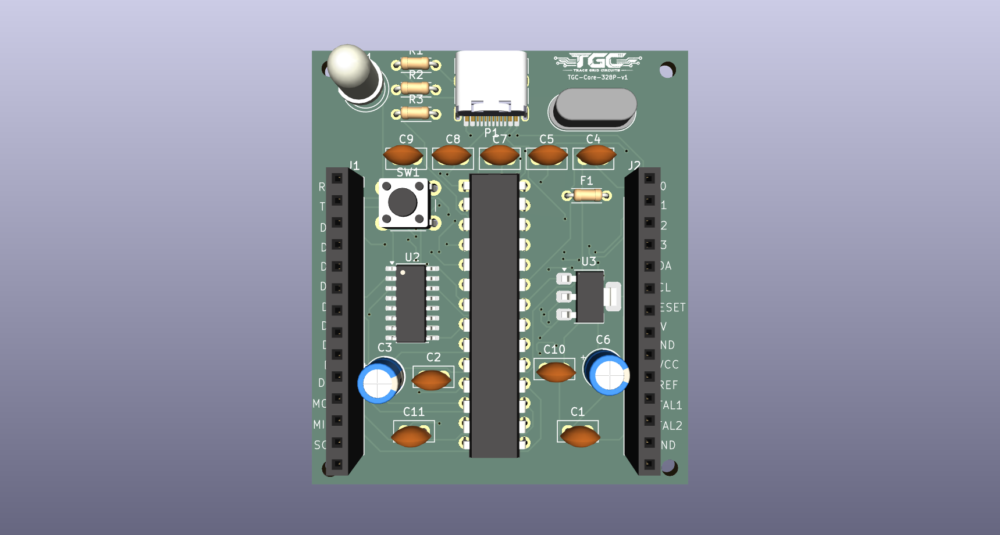

# TGC-Core-328P-v1

## Overview
The **TGC-Core-328P-v1** is an open-source hardware development board. Based on the file naming and standard conventions, it is designed around the "Mega" architecture (typically the Microchip ATme[...] 

This repository contains the complete set of KiCad EDA files necessary to view, modify and manufacture the printed circuit board (PCB).

---

## Features
* **Architecture:** Mega-compatible (ATmega2560) platform.
* **Modern Connectivity:** Upgraded from the legacy USB Type-B to a robust **USB-C 2.0** connector.
* **Native KiCad Design:** Fully designed using KiCad, allowing for easy community modification and inspection.
* **Standard Form Factor:** Designed for compatibility with existing shields and standard development workflows.

---

## Repository Structure

The project is entirely self-contained within the following KiCad design files:

| File Name | Description |
| :--- | :--- |
| `TGC-Core-devboard-Mega-v1.kicad_pro` | The main **KiCad Project file**. Open this file to load the entire project space. |
| `TGC-Core-devboard-Mega-v1.kicad_sch` | The **Schematic file**. Contains the logical connections, components (like the USB-C plug and SW_Push buttons), and wiring. |
| `TGC-Core-devboard-Mega-v1.kicad_pcb` | The **PCB Layout file**. Contains the physical board routing, copper layers, and silkscreen definitions. |
| `TGC-Core-devboard-Mega-v1.png` | A visual render or top-down image of the board design. |

---

## Hardware Specifications (Expected)

*Based on standard Mega-compatible board parameters:*

* **Microcontroller:** ATmega2560 (8-bit AVR)
* **Operating Voltage:** 5V
* **Clock Speed:** 16 MHz
* **Digital I/O Pins:** 54 (of which 15 provide PWM output)
* **Analog Input Pins:** 16
* **Hardware Serial Ports (UARTs):** 4
* **Flash Memory:** 256 KB (8 KB used by bootloader)
* **SRAM:** 8 KB
* **EEPROM:** 4 KB

---

## Getting Started

### 1. Viewing and Editing the Hardware
To view or modify the hardware design:
1. Download and install [KiCad EDA](https://www.kicad.org/). *(Note: Ensure your KiCad version is up to date, as these files use modern KiCad file formatting).*
2. Open the `TGC-Core-devboard-Mega-v1.kicad_pro` file.
3. From the project manager, open the Schematic Editor or PCB Editor to explore the design.

### 2. Software & Programming
Because this board shares the Mega architecture, it is fully compatible with the standard Arduino ecosystem:
1. Open the [Arduino IDE](https://www.arduino.cc/en/software).
2. Connect the board via a USB-C cable to your computer.
3. Go to **Tools > Board** and select **Arduino Mega or Mega 2560**.
4. Go to **Tools > Port** and select the active COM port.
5. Upload your sketches normally.

---

## License

This hardware design and its accompanying documentation are licensed under the **GNU General Public License v3.0 (GPL-3.0-or-later)**.

Summary of your rights under GPLv3:
* You are free to use, study, share, and modify the material.
* If you distribute the work (or a derivative), you must license the whole work under GPLv3 as well (share-alike).
* You must provide source for distributed derivative works and include the GPLv3 license text and copyright notices.

For the full legal text, see the GNU licenses page: https://www.gnu.org/licenses/gpl-3.0.html

Note: To make the change complete, consider adding a `LICENSE` file containing the full GPLv3 text and an explicit copyright line (for example: "Copyright (c) 2026 ThatGuyCodes605"). I can add that file for you if you want.
